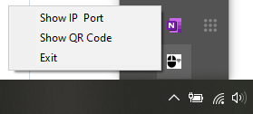
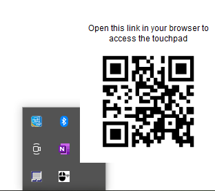
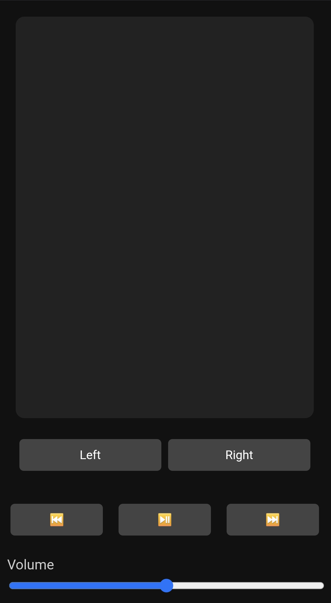
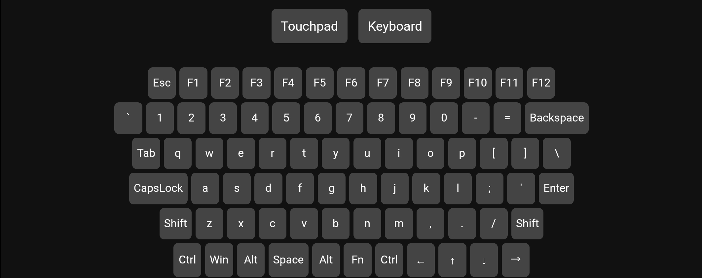

# 📱 Touchlet - A Remote Touchpad and Keyboard Web App

This project turns your mobile phone or tablet into a wireless **touchpad and keyboard** for your computer using a local network. It includes support for mouse movement, clicks, drag, two-finger scrolling, full keyboard, volume control, and media keys — all accessible from your phone's browser!

## 🌐 How It Works

- A Flask server runs on your computer and serves a responsive web app.
- When the app launches, it displays a **QR code** with your computer's local IP and port.
- Scan the QR code with a phone (on the same Wi-Fi network), and open the web app in your mobile browser.
- The web app provides:
  - A touchpad that sends real-time mouse movements.
  - Left/right click buttons.
  - A full on-screen keyboard with modifier keys.
  - Volume control via a slider.
  - Media control (Play/Pause, Next, Previous).

All communication between the client and server is handled via **WebSockets** using `flask-socketio`.

## ⚙️ Features

- 🖱️ **Touchpad Simulation**: Use your phone screen as a laptop-style touchpad.
  - Tap to click
  - Double-tap and move to drag
  - Two-finger scroll
- ⌨️ **Full Keyboard**: On-screen keyboard with:
  - Shift, Ctrl, Alt, CapsLock, Enter, Backspace, etc.
  - Button highlight when keys are pressed
  - Shift + Letter gives uppercase or symbols
- 🔊 **Volume Control**: Slider to set system volume (Windows only).
- 🎵 **Media Controls**: Previous, Play/Pause, Next buttons.
- 📱 **Responsive UI**: Touch-optimized and adapts to screen orientation.
- 🧠 **System Tray App**: Runs as a background tray application with options:
  - Show IP & Port
  - Show QR Code
  - Exit

## 🛠️ Installation

### 1. Clone this Repository
```
git clone https://github.com/Skanda-P-R/Remote-Touchpad-and-Keyboard-Web-App.git
```

### 2. Install the Requirements
(Optional to install Virtual Environment)<br>
```
python -m venv myenv
myenv\Scripts\activate
```
```
pip install -r requirements.txt
```

### 3. Run the Application
- Double click on `launch_app.vbs`. It will run the Application in your System Tray.
- Right Click on the App, and you will see three options:
  - Show IP & Port
  - Show QR Code
  - Exit

You can click on either `Show IP & Port` to view the IP and Port the App is running on, or Click on `Show QR Code` to Scan the QR code on your mobile, to automatically open the website where the Application is running.
### PS, if you want to launch it after Reboot, Just Double click the `launch_app.vbs`, it will run the App in the System Tray. If you want to run it on Windows Startup, follow the below steps.
<details>
<summary>Click to Expand!</summary>

1. Press `WIN` + `R` and type `shell:startup`.  
2. Right-click inside the folder → **New → Shortcut**  
3. In the location field, browse to your `launch_app.vbs` file, and enter its path.  
4. Click **Next**, give your shortcut a name (e.g., `StartRemoteTouchpad`), and click **Finish**.  
5. Restart or log off and log back in to test if the script runs at startup.

</details>

## 🖼️ Screenshots

| Tray Icon | Menu Options |
|-----------|--------------|
|  |  |

| Touchpad Mode | Keyboard Mode |
|---------------|---------------|
|  |  |

## 🔐 Network Note

- The app works **only in a local network** (your phone and PC must be connected to the same Wi-Fi).
- No data is sent outside your local network.

## 🧰 Tech Stack

- Python (Flask + Flask-SocketIO)
- JavaScript (client-side interaction)
- HTML/CSS (responsive design)
- pyautogui (mouse/keyboard control)
- pystray, qrcode, pycaw, Pillow (desktop integration)

## 🚀 Running the App

When you launch the Python script:

1. The server starts on your local IP and port `5000`.
2. A **QR code** is shown with the URL (e.g., `http://192.168.1.5:5000`).
3. Scan the QR using your phone and interact via the web interface.

---

## 📎 License

This project is open-source. See `LICENSE` for details.

